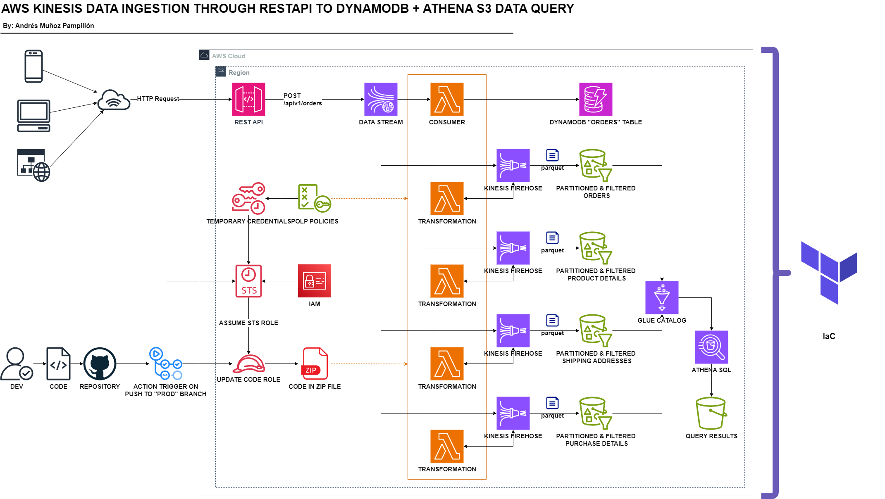

# AWS KINESIS DATA INGESTION THROUGH RESTAPI TO DYNAMODB + ATHENA S3 DATA QUERY

Welcome to this AWS data project, showcasing a fully functional architecture. The objective of this repository is to demonstrate how to integrate data ingestion through a REST API endpoint into a fully managed AWS architecture using Kinesis Data Stream. By leveraging serverless resources, it is possible to efficiently manage and process data. Using various intermediary services like Lambda functions and Firehose, you can handle large volumes of data, transforming it into optimized formats for storage and post-processing using Athena with SQL, or by sending data directly to a NoSQL database for active use.

Additionally, all the infrastructure is deployed using Terraform, which reduces duplication, speeds up deployment, and simplifies the management of complex environments. With the use of GitHub Actions for updating the Lambda Python code, we have established a CI/CD environment.

The main philosophy of this project is to facilitate the usage of data while maintaining lower costs by using pay-as-you-go services where costs are incurred only based on actual usage. This reduces the time required for setting up and maintaining infrastructure, allowing more focus on transforming and leveraging the data.

## RESOURCES

In this repo, the following resources are provided:
 - [TERRAFORM FILES](terraform): Contains Terraform resources used to deploy the AWS infrastructure.
 - [LAMBDA KINESIS CONSUMER](lambda_kinesis_consumer): Source code of the Lambda function in charge of consuming Kinesis Data Stream and putting these records into DynamoDB.
 - Python code used to transform Firehose data via Lambda functions:
     - [LAMBDA ORDERS](lambda_orders_transformation)
     - [LAMBDA PRODUCT DETAILS](lambda_product_details_transformation)
     - [LAMBDA PURCHASE DETAILS](lambda_purchase_details_transformation)
     - [LAMBDA SHIPPING ADDRESSES](lambda_shipping_addresses_transformation)
 - [GITHUB ACTION](.github/workflows): YAML file used by GitHub Actions to update Lambda code when pushes are made to the `prod` branch.
 - [POST PRODUCER](python_post_producer): Python code used to send fake data to API Gateway using POST.
 - [ATHENA QUERIES](athena_sql_query_examples): SQL example queries to run in Athena for analytics purposes.

## REST API INGESTION

Using AWS API Gateway, it is possible to ingest data through a POST request and send it directly to Kinesis Data Stream. This is a convenient way of integrating a stream pipeline into an existing architecture or a new one, detaching the source of the data from the actual pipeline and the services involved in the background. Additionally, it is possible to reuse the pipeline by providing more endpoints and mapping the data to Kinesis.

One key benefit of using REST API is that we can add layers of security using tokens. Another significant advantage is that using REST API is a simple method of integration and provides developers with an easy and well-known technology.

## KINESIS DATA STREAM

Kinesis Data Stream acts as the central point where all data arrives in the actual pipeline. Here, in the shards, the data gets stored temporarily. An important point is that it can have multiple sources, such as multiple REST API endpoints, allowing multiple consumers to get the data based on their handling capabilities. It's a fully AWS-managed service, so most of the heavy lifting of configuration and resource management is already done.

## LAMBDA CONSUMER

Lambda functions can be triggered by Kinesis Data Stream and can process events in batches. In this case, with the help of Boto3, the Lambda function puts records into DynamoDB. The code is responsible for structuring the data, defining the partition key, and sort key used in the DynamoDB table.

## DYNAMO DB

Probably the best option to store high-frequency request data, DynamoDB, with its NoSQL architecture and high IOPS, can handle multiple reads and writes efficiently. It is perfect for integrating with services and features from other areas. In this case, the orders table contains a partition key "customer_id" and a sort key "order_id," along with the rest of the columns.

## KINESIS FIREHOSE

Firehose is a great option to consume data from Kinesis Data Stream. It provides the possibility of using a Lambda function "attached" to transform or process the streamed events from Kinesis. With Firehose, there are multiple destination options; in this case, the selected one is S3. One of the key features of writing selected data to S3 is the possibility of applying dynamic partitioning by using metadata generated by the Lambda function and applying a Parquet format conversion directly, getting the table schemas from AWS Glue. In this architecture, there are 4 Firehose streams, each with a Lambda function, which writes the filtered and transformed Parquet partitions for orders, product_details, purchase_details, and shipping_addresses data.

## GLUE

Glue provides the option to create a database with tables that contain the schemas for writing Parquet files in S3. Glue automatically crawls the data stored in S3, inferring the schema and creating tables that can be queried using services like Athena. This eliminates the need for manual schema management and makes it easy to query and analyze the data.

With Glue, you can schedule regular crawls to keep the schema updated as new data is added. Additionally, Glue ETL (Extract, Transform, Load) jobs can be used to transform and clean the data before it is stored in S3, ensuring the data is in the correct format and optimized for querying.

In this architecture, Glue plays a crucial role by providing the necessary metadata for the data stored in S3, allowing seamless integration with Athena for powerful and cost-effective querying capabilities. The Glue catalog also serves as a centralized metadata repository, making it easier to manage and maintain the data schema over time.

## ATHENA

Athena plays a crucial role in accessing and analyzing the data stored in S3 through SQL queries. It allows for making complex cross-table queries and provides the option to save SQL statements for future reference. Additionally, Athena can write query results back into S3 in formats like CSV, which is ideal for further data processing and analytics.

One of Athena's key advantages is its serverless nature, requiring no infrastructure setup. Developers can simply access the Athena console, write SQL queries in the query editor, and gain insights from their data stored in S3. This makes it a powerful tool for ad-hoc querying and data exploration without the overhead of managing infrastructure.

In this architecture, Athena integrates seamlessly with the Glue catalog, leveraging the schema information stored there to facilitate querying of Parquet files stored in S3. This integration enables efficient and cost-effective analytics workflows, empowering users to derive meaningful insights from their data.

## 
